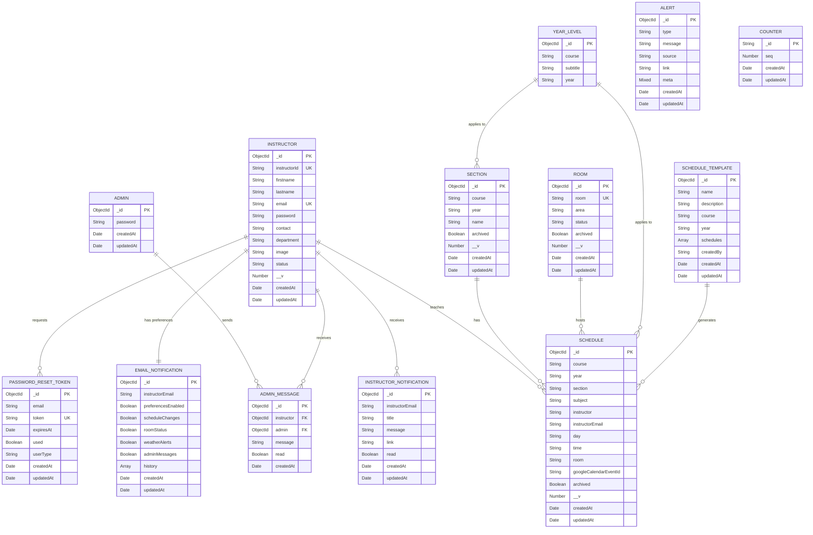

# Entity Relationship Diagram (ERD)

## Class Scheduling System Database ERD

This document provides a visual representation of the database relationships using Mermaid syntax. You can view this diagram in any Markdown viewer that supports Mermaid (e.g., GitHub, GitLab, VS Code with Mermaid extension, or online tools like mermaid.live).

---

## Mermaid ERD Diagram



---

## Relationship Details

### Primary Relationships

1. **Admin → AdminMessage** (One-to-Many)
   - One admin can send multiple messages
   - Relationship: `admin` field in `AdminMessage` references `Admin._id`

2. **Instructor → Schedule** (One-to-Many)
   - One instructor can teach multiple schedules
   - Relationship: `instructor` and `instructorEmail` in `Schedule` match `Instructor` fields

3. **Instructor → AdminMessage** (One-to-Many)
   - One instructor can receive multiple admin messages
   - Relationship: `instructor` field in `AdminMessage` references `Instructor._id`

4. **Instructor → InstructorNotification** (One-to-Many)
   - One instructor can receive multiple notifications
   - Relationship: `instructorEmail` in `InstructorNotification` matches `Instructor.email`

5. **Instructor → EmailNotification** (One-to-One)
   - One instructor has one email notification preference record
   - Relationship: `instructorEmail` in `EmailNotification` matches `Instructor.email`

6. **Instructor → PasswordResetToken** (One-to-Many)
   - One instructor can have multiple reset tokens (over time)
   - Relationship: `email` in `PasswordResetToken` matches `Instructor.email`

7. **Section → Schedule** (One-to-Many)
   - One section can have multiple schedules
   - Relationship: `course`, `year`, `section` in `Schedule` match `Section` fields

8. **Room → Schedule** (One-to-Many)
   - One room can host multiple schedules
   - Relationship: `room` in `Schedule` matches `Room.room`

9. **YearLevel → Schedule** (One-to-Many)
   - One year level can have multiple schedules
   - Relationship: `year` in `Schedule` matches `YearLevel.year`

10. **YearLevel → Section** (One-to-Many)
    - One year level can have multiple sections
    - Relationship: `year` in `Section` matches `YearLevel.year`

11. **ScheduleTemplate → Schedule** (One-to-Many)
    - One template can generate multiple schedules
    - Relationship: Logical (templates are used to create schedules)

### Standalone Entities

- **Alert**: No direct relationships (system-wide alerts)
- **Counter**: No direct relationships (utility for ID generation)

---

## Relationship Types

- **||--o{**: One-to-Many (one entity can have many related entities)
- **||--||**: One-to-One (one entity has exactly one related entity)

---

## Key Constraints

### Unique Constraints
- `Instructor.email` - Unique
- `Instructor.instructorId` - Unique (sparse)
- `Room.room` - Unique
- `Section` (course, year, name) - Unique combination
- `PasswordResetToken.token` - Unique

### Foreign Key Relationships
- `AdminMessage.instructor` → `Instructor._id`
- `AdminMessage.admin` → `Admin._id`

### Indexes
- Multiple compound indexes for efficient querying
- TTL index on `PasswordResetToken.expiresAt` for auto-deletion

---

## How to View This Diagram

1. **GitHub/GitLab**: The diagram will render automatically in Markdown files
2. **VS Code**: Install the "Markdown Preview Mermaid Support" extension
3. **Online**: Copy the Mermaid code and paste it into [mermaid.live](https://mermaid.live)
4. **Documentation Tools**: Most modern documentation tools support Mermaid diagrams

---

## Alternative: Text-Based ERD

```
┌─────────────────┐
│     ADMIN       │
│─────────────────│
│ _id (PK)        │
│ password        │
└────────┬────────┘
         │
         │ 1
         │
         │ N
┌────────▼─────────────────┐
│    ADMIN_MESSAGE         │
│──────────────────────────│
│ _id (PK)                 │
│ instructor (FK)          │
│ admin (FK) ──────────────┼──┐
│ message                  │  │
│ read                     │  │
└────────┬─────────────────┘  │
         │                     │
         │ N                   │
         │                     │
┌────────▼────────┐           │
│   INSTRUCTOR    │           │
│─────────────────│           │
│ _id (PK)        │◄──────────┘
│ instructorId (UK)│
│ email (UK)      │
│ ...             │
└────────┬────────┘
         │
         │ 1
         │
    ┌────┴────┬──────────────┬──────────────┬──────────────┐
    │         │              │              │              │
    │ N       │ 1            │ N            │ N            │
    │         │              │              │              │
┌───▼───┐ ┌──▼──────────┐ ┌─▼──────────┐ ┌─▼──────────────┐
│SCHEDULE│ │EMAIL_NOTIF │ │INSTRUCTOR_ │ │PASSWORD_RESET  │
│       │ │            │ │NOTIFICATION│ │TOKEN           │
└───┬───┘ └────────────┘ └────────────┘ └────────────────┘
    │
    │ N
    │
    │ 1
┌───▼──────┐
│  SECTION │
└──────────┘

┌──────────┐
│   ROOM   │
│──────────│
│ _id (PK) │
│ room (UK)│
└────┬─────┘
     │
     │ 1
     │
     │ N
┌────▼──────┐
│  SCHEDULE │
└───────────┘
```

---

## Notes

1. **String-based Relationships**: Most relationships use string matching rather than ObjectId references (e.g., `Schedule.instructor` matches `Instructor` by name/email, not ObjectId).

2. **Soft Deletes**: Several entities use `archived` flags instead of hard deletes.

3. **Version Control**: Core entities (`Instructor`, `Schedule`, `Section`, `Room`) use `__v` for optimistic concurrency control.

4. **Email as Identifier**: Many relationships use email addresses as identifiers rather than ObjectIds for flexibility.

